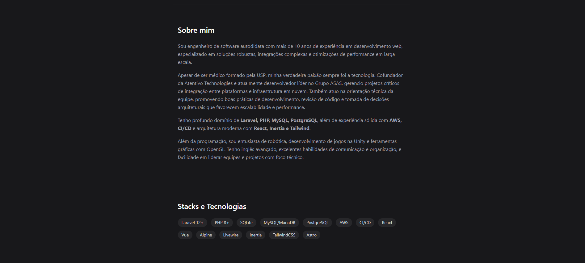
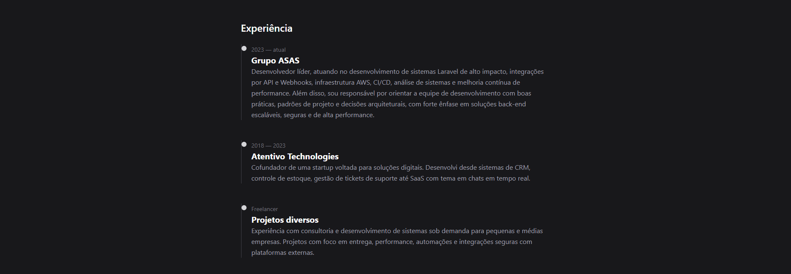
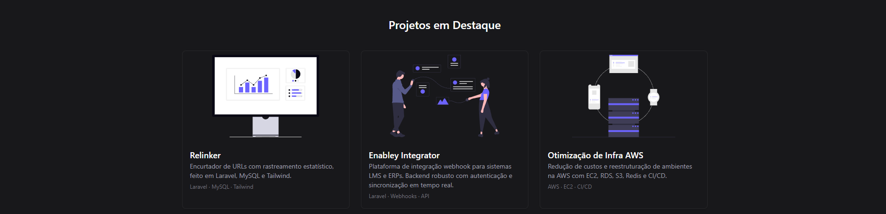

# My Portfolio - Jauro Fleck

Este é meu portfólio pessoal desenvolvido com [Astro](https://astro.build), [TailwindCSS](https://tailwindcss.com) e React, com foco em desempenho, clareza e elegância. O objetivo é apresentar minha trajetória profissional, habilidades técnicas e projetos em destaque de forma direta e impactante.

## ✨ Tecnologias Utilizadas

- [Astro](https://astro.build/) – framework leve para páginas estáticas
- [TailwindCSS](https://tailwindcss.com/) – estilização com utilitários
- [Astro Assets](https://docs.astro.build/en/guides/assets/) – para imagens otimizadas

## 📁 Estrutura

src/  
├── pages/               # Páginas principais (index.astro, etc)  
├── layouts/             # Layout base compartilhado  
├── styles/              # Estilos globais (Tailwind + custom)  
├── img/                 # Imagens de perfil e assets ilustrativos  
├── undraw/              # Ilustrações SVG usadas nos cards de projeto  

## 🚀 Como rodar localmente

Requisitos:
- Node.js 18+
- PNPM, Yarn ou NPM

Clone o repositório e instale as dependências:

```bash
git clone https://github.com/jaurofleck/my-portfolio.git
cd my-portfolio
npm install
npm dev
```

Acesse `http://localhost:4321` para visualizar.

## 📷 Screenshots






## 📜 Licença

Este projeto está sob a licença [MIT](LICENSE). Fique à vontade para se inspirar, clonar ou adaptar, desde que com os devidos créditos.

## 📫 Contato

Caso queira conversar sobre oportunidades, colaborações ou dúvidas técnicas:

- Site: [jaurofleck.com](https://jaurofleck.com)
- Email: `jaurofleck@gmail.com`
- LinkedIn: [linkedin.com/in/jauro-fleck-m-d-867159145/](https://www.linkedin.com/in/jauro-fleck-m-d-867159145/)

---

> Desenvolvido com café, código e paixão por sistemas performáticos.
